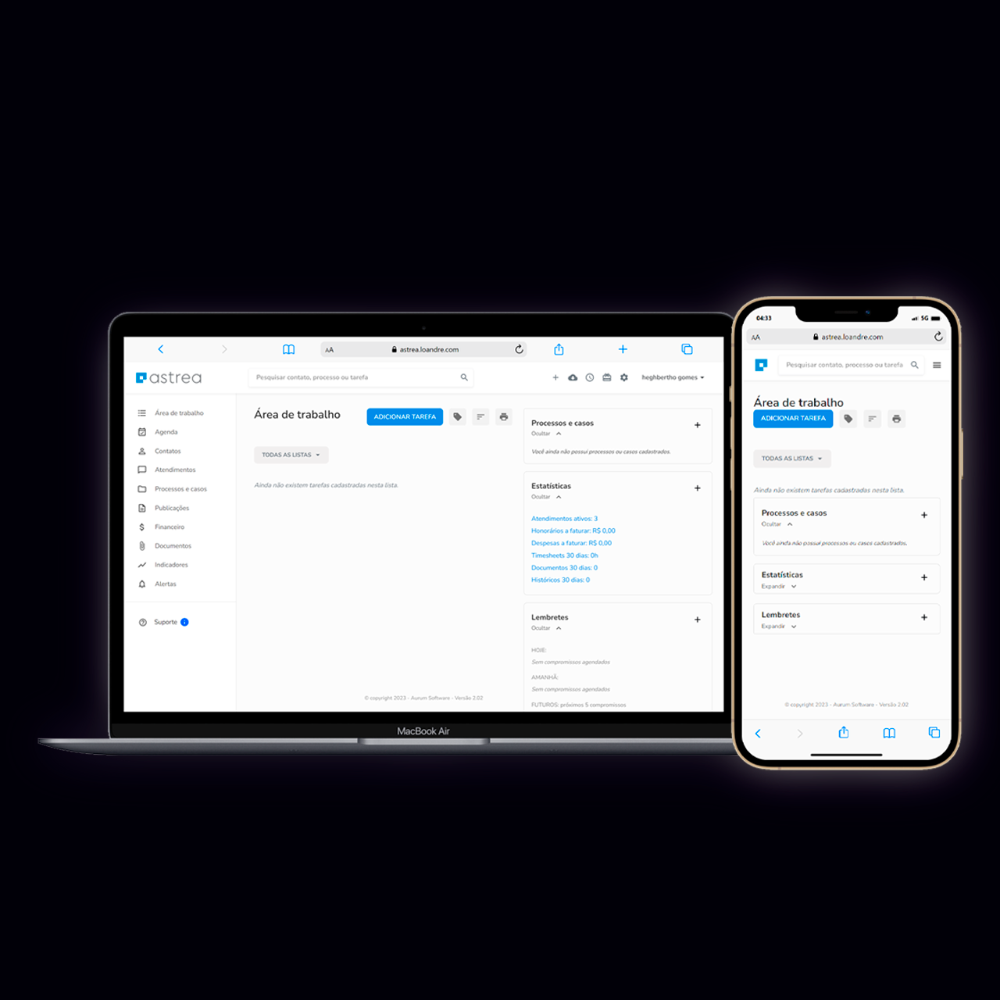

# Desafio Técnico - Clone de Interface do Sistema Astrea



## 🔗 [Confira o Resultado](https://astrea.loandre.com/)

**IMPORTANTE: Para acessar a aplicação, utilize as seguintes credenciais:**

- **Login:** betho@soffia.com
- **Senha:** soffia

Este projeto é uma resposta ao desafio proposto pela empresa Madgic. O objetivo principal foi desenvolver uma interface que reproduza as funcionalidades das telas do sistema Astrea, utilizando React e integrando-o com a API fornecida pela empresa para leitura e alimentação de dados.

## 🎯 Objetivo do Projeto

O objetivo principal deste projeto é desenvolver uma interface que reproduza as funcionalidades das telas do sistema Astrea, utilizando React e integrando-o com a API fornecida pela empresa para leitura e alimentação de dados.

### 📋 Roteiro do Desafio

- **Criar uma interface com as seguintes telas do sistema Astrea:**
  - Tela de Login
  - Tela Principal
  - Tela de Criar e Listar Atendimentos
  - Tela de Criar e Listar Anotações

- **Integrar a aplicação com a API fornecida:**
  - Consumir os endpoints da API para ler e alimentar os dados do sistema.

- **Utilizar Material UI:**
  - Implementar os componentes da interface utilizando a biblioteca Material UI.

- **Responsividade para Mobile:**
  - Garantir que a aplicação seja totalmente responsiva, proporcionando uma experiência suave em dispositivos móveis.

### 💻 Como Executar o Projeto

Para executar o projeto localmente, siga os passos abaixo:

1. **Clone o repositório para sua máquina local:**

   ```sh
   git clone https://github.com/seu-usuario/astrea.git


2. **Navegue até o diretório do projeto:**
	
    ```sh
    cd [Nome do Projeto]
 
3. **Instale as dependências necessárias:**
	
    ```sh
    npm install
 
4. **Execute o projeto:**
	
    ```sh
    npm start

### 🌟 Agradecimentos
Gostaria de expressar minha gratidão a Betho Junior e à empresa Madgic pela oportunidade de realizar este desafio técnico. Foi uma experiência enriquecedora e desafiadora que contribuiu significativamente para o meu desenvolvimento profissional.
